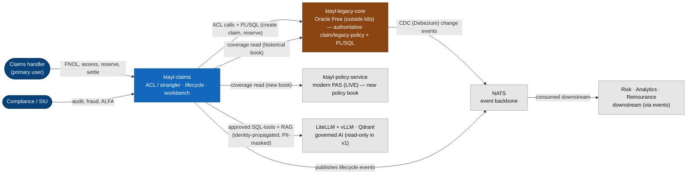
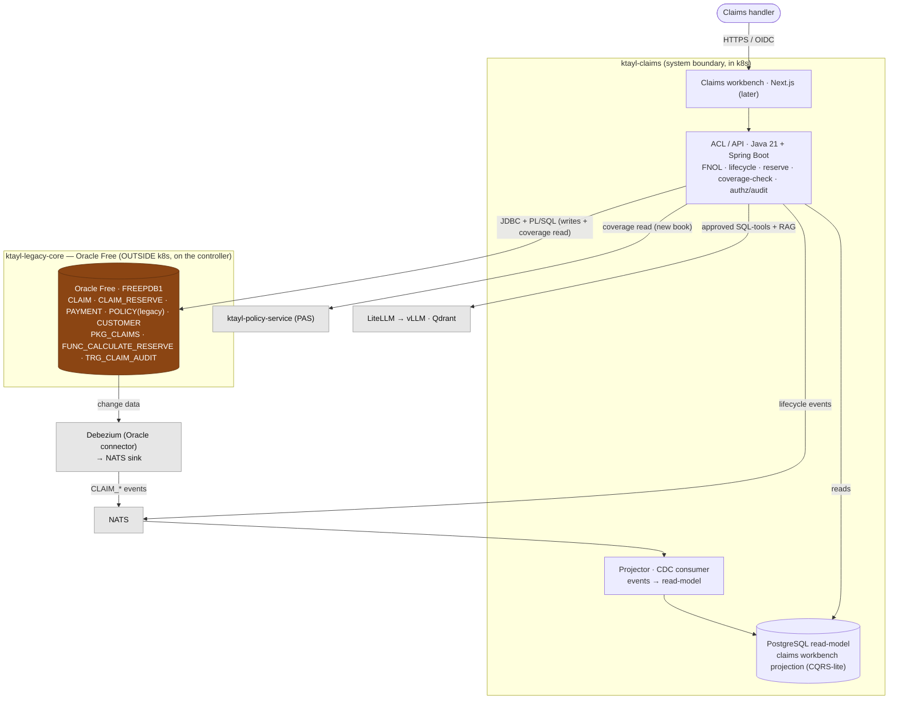
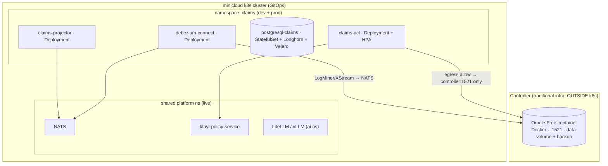

# Solution Architecture — Claims (strangler over a legacy Oracle core) (#11)

> **BMAD/SA artefact — the technical spine.** Path-C. Assembles the C4 views, the
> [NFR Register](./nfr-register.md), the [Threat Model](./threat-model.md) and the [ADR log](./adr/000-index.md).
> Owner = SA/TL; approved at the **architecture spine review + security review** gates.
> **Status: DRAFT for review — no build.**

## 1. Overview

`ktayl-claims` is the modern **Anti-Corruption Layer / strangler** over a deliberate **legacy Oracle core**
(`ktayl-legacy-core`). The legacy holds the authoritative claim/legacy-policy record and its PL/SQL business
logic and **stays** (Strangler Fig — wrapped, not replaced). The ACL exposes clean claims APIs, **CDC
(Debezium) publishes legacy changes to NATS**, and a **Postgres read-model** projects those events to power
the workbench (CQRS-lite, keeping read load off Oracle). Nothing but the ACL and the CDC connector touches
Oracle. Delivery follows the platform GitOps + Kargo model.

**Technology stack** (ADR-006): legacy = **Oracle Free + PL/SQL** (container, outside k8s); ACL =
**Java 21 + Spring Boot** (candidate — the realistic enterprise-Oracle-wrapping stack; confirm vs FastAPI);
CDC = **Debezium → NATS**; read-model = **PostgreSQL**; frontend (later) = Next.js.

**Decisions of record** (full log in [ADRs](./adr/000-index.md)):
- **ADR-001** — **Strangler Fig + ACL**: the legacy is authoritative and frozen; modern services wrap it, never write around it.
- **ADR-002** — **Oracle Free, OUTSIDE k8s** (container on the controller/a node) — realism + off the constrained cluster.
- **ADR-003** — **CDC over polling** (Debezium → **NATS**, not Kafka); events are the downstream contract.
- **ADR-004** — **CQRS-lite read-model** (Postgres) projected from CDC; reads never hit Oracle.
- **ADR-005** — **AI reaches structured data only via approved ACL SQL-tools** (RAG for docs); identity propagated; no autonomous action.
- **ADR-006** — stack (above). **ADR-007** — the bounded migration is a *later, optional* footnote; the legacy stays.

## 2. C4 — Level 1: System Context

## 3. C4 — Level 2: Containers

## 4. C4 — Level 3: Deployment

**Delivery:** GitOps (ArgoCD) + **Kargo** dev→prod for the in-cluster services (ACL, projector), Helm
wrapper-chart golden path; Authentik OIDC, **ESO/Vault** for the Oracle creds (`secret/platform/oracle-legacy`),
cert-manager TLS, **default-deny NetworkPolicy with an explicit egress allow to `controller-ip:1521` only**.
The Oracle container itself is **not** GitOps-managed (traditional infra) — provisioned via a documented
runbook, like MinIO.

## 5. Component responsibilities

| Component | Stack | Owns | Notes |
|---|---|---|---|
| **Legacy core** | Oracle Free + PL/SQL | authoritative claim/legacy-policy record + business rules | frozen; wrapped not refactored (ADR-001) |
| **ACL / API** | Java 21 + Spring Boot | FNOL, lifecycle, reserve, coverage-check, authz, audit, AI tools | the only writer to the legacy |
| **Debezium** | Oracle connector → NATS | capture legacy changes as events | ADR-003; not Kafka |
| **Projector** | CDC consumer | events → read-model | ADR-004 |
| **Read-model** | PostgreSQL | workbench projection | reads never hit Oracle |

## 6. Key data flows

1. **FNOL:** handler → ACL → **coverage check** (legacy `POLICY`) → `PROC_CREATE_CLAIM` (legacy) →
   `TRG_CLAIM_AUDIT` records it → Debezium emits `CLAIM_CREATED` → projector updates the read-model.
2. **Reserve:** ACL → `FUNC_CALCULATE_RESERVE` (legacy) → `RESERVE_ADJUSTED` event → read-model + downstream.
3. **Settle/close:** ACL drives the legacy state-machine → `CLAIM_STATUS_CHANGED` / `CLAIM_PAID` events.
4. **AI (v1, read-only):** handler question → ACL SQL-tool (approved columns, identity-scoped, PII-masked) →
   read-model/legacy; document questions → RAG (Qdrant). Never the LLM emitting SQL at Oracle.

## 7. Cross-references

[Brief](../brief.md) · [PRD](../prd.md) · [NFR Register](./nfr-register.md) · [Threat Model](./threat-model.md) · [ADR log](./adr/000-index.md) · [Legacy-Core Modernization](https://andrelair-platform.github.io/minicloud-platform-docs/insurance-platform/legacy-core-modernization)
