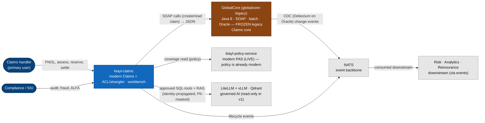
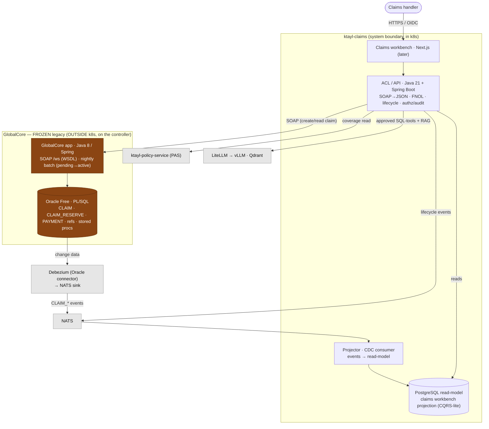
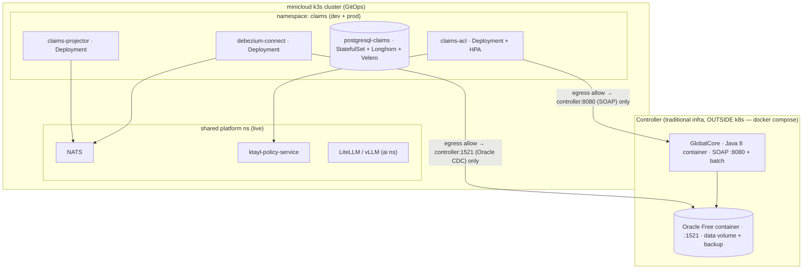

# Solution Architecture — Claims (modern wrap over the GlobalCore legacy) (#11)

> **BMAD/SA artefact — the technical spine.** Path-C. Assembles the C4 views, the
> [NFR Register](./nfr-register.md), the [Threat Model](./threat-model.md) and the [ADR log](./adr/000-index.md).
> Owner = SA/TL; approved at the **architecture spine review + security review** gates.
> **Status: DRAFT for review — no build.**

## 1. Overview

`ktayl-claims` is the **modern Claims capability, built AS the Anti-Corruption Layer / strangler** over the
**GlobalCore** legacy (`globalcore-legacy`). GlobalCore is a deliberately-legacy carrier we own and
**freeze** — **Java 8 · Spring · SOAP · nightly batch · stored procedures · Oracle · outside k8s** — evolved
to hold the **Claims** domain (the domain we *need but haven't built*; Policy is already modern in the live
PAS). Wrapping GlobalCore is how modern Claims is *delivered*: the ACL translates **SOAP→JSON**, models the
**async batch** (create → pending → activated), publishes legacy changes as **CDC events on NATS**, and a
**Postgres read-model** powers the workbench. Nothing but the ACL (SOAP) and the CDC connector (Oracle)
touches the legacy.

**Technology stack** (ADR-006): legacy engine = **GlobalCore** (Java 8 / Spring / SOAP, **Oracle Free** +
PL/SQL); ACL/strangler = **Java 21 + Spring Boot** (candidate — mature SOAP client + JPA; confirm vs FastAPI);
CDC = **Debezium (Oracle) → NATS**; read-model = **PostgreSQL**; frontend (later) = Next.js.

**Decisions of record** ([ADRs](./adr/000-index.md)):
- **ADR-001** — **Strangler Fig + ACL** over GlobalCore; the legacy is authoritative and **frozen** (never edited to ease a modern feature).
- **ADR-002** — legacy = **GlobalCore (existing repo) on Oracle Free, OUTSIDE k8s** — not a new `ktayl-legacy-core`, not Postgres.
- **ADR-003** — the wrap surface is **SOAP→JSON (writes) + CDC Debezium→NATS (events)**; the batch async model is preserved, not hidden.
- **ADR-004** — **CQRS-lite read-model** (Postgres) projected from CDC; reads never hit the legacy.
- **ADR-005** — **AI via approved ACL SQL-tools** (RAG for docs); identity-propagated, PII-masked, no AI writes.
- **ADR-006** — stack. **ADR-007** — an Oracle→Postgres migration is a *later, optional* footnote; the legacy stays.

## 2. C4 — Level 1: System Context

## 3. C4 — Level 2: Containers

## 4. C4 — Level 3: Deployment

**Delivery:** GitOps (ArgoCD) + **Kargo** dev→prod for the in-cluster services (ACL, projector), Helm
wrapper-chart golden path; Authentik OIDC; **ESO/Vault** for the Oracle CDC creds (`secret/platform/oracle-legacy`);
cert-manager TLS; **default-deny NetworkPolicy** with explicit egress: the **ACL → GlobalCore SOAP
(controller:8080)** and **Debezium → Oracle (controller:1521)** only — nothing else in-cluster reaches the
legacy. GlobalCore + Oracle are **not** GitOps-managed (traditional infra, docker-compose runbook — like MinIO).

## 5. Component responsibilities

| Component | Stack | Owns | Notes |
|---|---|---|---|
| **GlobalCore** | Java 8 / SOAP / batch / **Oracle + PL/SQL** | authoritative claim record + business rules (reserve calc, state) | **frozen** — wrapped not edited (ADR-001) |
| **ACL / API** | Java 21 + Spring Boot | SOAP→JSON, FNOL, lifecycle, coverage-check, authz, audit, AI tools | the only SOAP client of GlobalCore |
| **Debezium** | Oracle connector → NATS | capture legacy Oracle changes as events | ADR-003; not Kafka |
| **Projector** | CDC consumer | events → read-model | ADR-004 |
| **Read-model** | PostgreSQL | workbench projection | reads never hit the legacy |

## 6. Key data flows

1. **FNOL:** handler → ACL → **coverage check** (PAS) → **SOAP `CreateClaim`** to GlobalCore → claim lands
   **`pending`**; GlobalCore's PL/SQL + batch own the record; Debezium emits `CLAIM_CREATED` → projector updates
   the read-model. The ACL models the async "pending until batch activates" honestly (no fake real-time).
2. **Reserve / lifecycle:** ACL → SOAP ops → GlobalCore stored procs drive reserve + state; `RESERVE_ADJUSTED`
   / `CLAIM_STATUS_CHANGED` events flow via CDC.
3. **AI (v1, read-only):** handler question → ACL SQL-tool (approved columns, identity-scoped, PII-masked) →
   read-model; document questions → RAG (Qdrant). Never the LLM speaking SOAP or SQL to the legacy.

## 7. Cross-references

[Brief](../brief.md) · [PRD](../prd.md) · [NFR Register](./nfr-register.md) · [Threat Model](./threat-model.md) · [ADR log](./adr/000-index.md) · [Legacy-Core Modernization](https://andrelair-platform.github.io/minicloud-platform-docs/insurance-platform/legacy-core-modernization) · GlobalCore: `globalcore-legacy` · wrapper spec: `ktayl-integration/docs/legacy-wrapper-initiative-spec.md`
