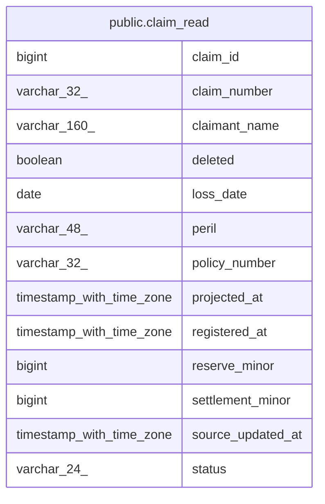

# claims

## Tables

| Name                                      | Columns | Comment | Type       |
| ----------------------------------------- | ------- | ------- | ---------- |
| [public.claim_read](public.claim_read.md) | 13      |         | BASE TABLE |

## Relations

---

> Generated by [tbls](https://github.com/k1LoW/tbls)
