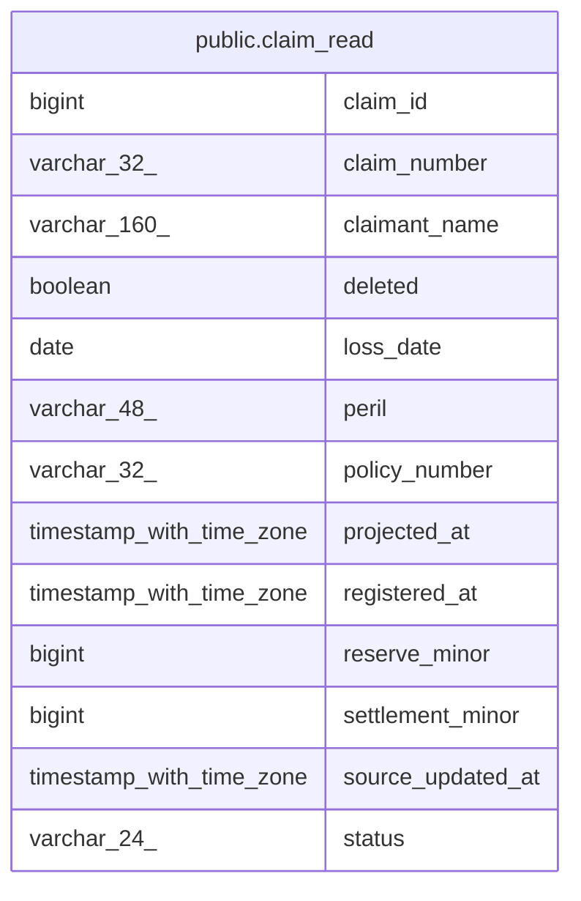

# public.claim_read

## Columns

| Name              | Type                     | Default | Nullable | Children | Parents | Comment |
| ----------------- | ------------------------ | ------- | -------- | -------- | ------- | ------- |
| claim_id          | bigint                   |         | false    |          |         |         |
| claim_number      | varchar(32)              |         | false    |          |         |         |
| claimant_name     | varchar(160)             |         | false    |          |         |         |
| deleted           | boolean                  | false   | false    |          |         |         |
| loss_date         | date                     |         | false    |          |         |         |
| peril             | varchar(48)              |         | false    |          |         |         |
| policy_number     | varchar(32)              |         | false    |          |         |         |
| projected_at      | timestamp with time zone | now()   | false    |          |         |         |
| registered_at     | timestamp with time zone |         | false    |          |         |         |
| reserve_minor     | bigint                   |         | true     |          |         |         |
| settlement_minor  | bigint                   |         | true     |          |         |         |
| source_updated_at | timestamp with time zone |         | true     |          |         |         |
| status            | varchar(24)              |         | false    |          |         |         |

## Constraints

| Name                        | Type        | Definition             |
| --------------------------- | ----------- | ---------------------- |
| claim_read_claim_number_key | UNIQUE      | UNIQUE (claim_number)  |
| claim_read_pkey             | PRIMARY KEY | PRIMARY KEY (claim_id) |

## Indexes

| Name                        | Definition                                                                                      |
| --------------------------- | ----------------------------------------------------------------------------------------------- |
| claim_read_claim_number_key | CREATE UNIQUE INDEX claim_read_claim_number_key ON public.claim_read USING btree (claim_number) |
| claim_read_pkey             | CREATE UNIQUE INDEX claim_read_pkey ON public.claim_read USING btree (claim_id)                 |
| idx_claim_read_policy       | CREATE INDEX idx_claim_read_policy ON public.claim_read USING btree (policy_number)             |
| idx_claim_read_status       | CREATE INDEX idx_claim_read_status ON public.claim_read USING btree (status)                    |

## Relations

---

> Generated by [tbls](https://github.com/k1LoW/tbls)
